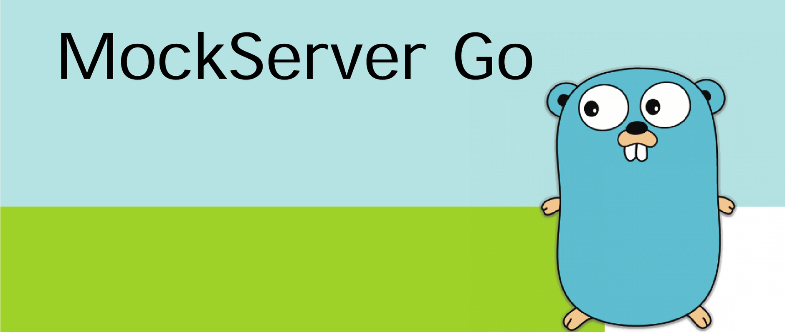

# GoMock Server



A simple mock server configurable via JSON, built using GoLang.

### How To

A file name `endpoint.json` must be placed in the context root, with the following structure:

```json
{
  "endpoints": [
    {
      "uri": "/test",
      "response": {
        "status_code": 200,
        "body": "{ \"payload\": \"This is a response body!\" }"
      }
    }
  ]
}
```

by analog-alex (Miguel Alexandre) @2022
